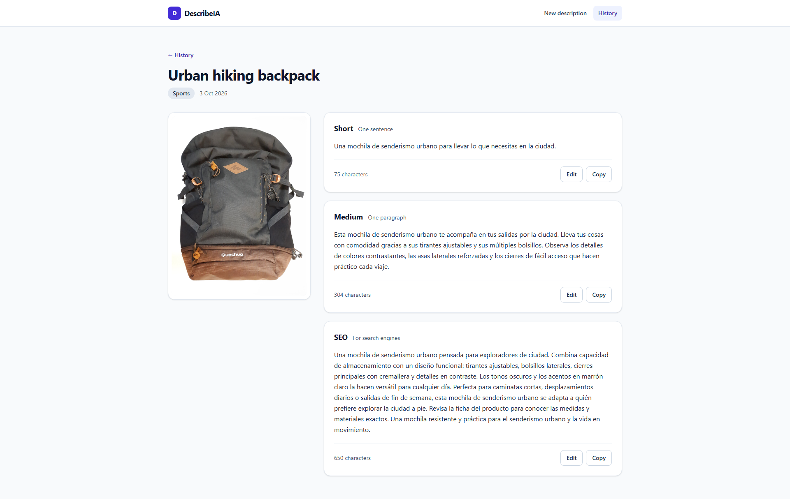
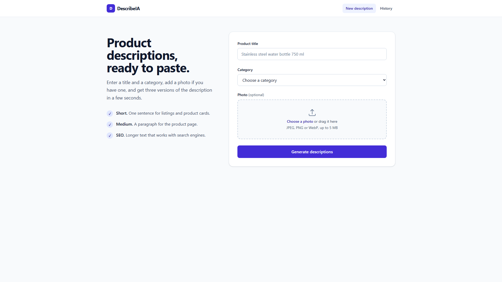
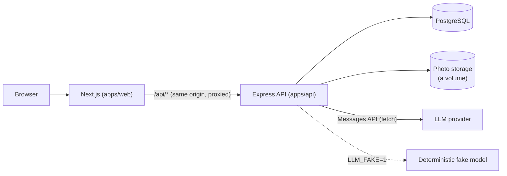

# DescribeIA

DescribeIA writes product descriptions for online stores. You give it a product title, a category and,
if you have one, a photo. One call to an LLM returns three versions you can copy or edit:

- **Short**: one sentence for listings and product cards.
- **Medium**: a paragraph for the product page.
- **SEO**: a longer text written for search engines.

Edits never overwrite what the model wrote (the original is kept), every generated product is saved in a
history, and every model call is recorded with its tokens, latency and cost, so the real price of a
description is measured, not guessed.



<details>
<summary>The form</summary>



</details>

It is a small but complete full-stack project: a Next.js front end, an Express API, PostgreSQL, calls to
the Anthropic Messages API with plain `fetch`, and an end-to-end test of the whole stack that runs
without spending a cent.

## Architecture



Inside the API, each layer has one job:

| Folder            | Responsibility                                                                     |
| ----------------- | ---------------------------------------------------------------------------------- |
| `src/routes/`     | HTTP handlers: validate the request, call a service, shape the response            |
| `src/generation/` | The business logic: build the prompt, ask the model, validate and store the answer |
| `src/llm/`        | The only code that talks to the provider: client, retries, pricing, call recording |
| `src/db/`         | Connection pool and plain-SQL repositories (no ORM)                                |
| `src/images/`     | Photo validation (magic bytes, not file names), resizing for the model, storage    |
| `src/cost/`       | The cost report and the usage endpoint                                             |
| `prompts/`        | Versioned prompt files; the code never contains prompt text                        |

Choices worth knowing about:

- **Structured output.** The model is asked for JSON that follows a schema, and the answer is validated
  with zod again on arrival. An invalid answer is retried once and recorded as such.
- **Every call is recorded**, failures included, in the `llm_calls` table with the cost computed from a
  price table in the code.
- **Same-origin API.** The browser only talks to its own origin; Next.js forwards `/api/*` to the API, so
  there is no CORS configuration.
- **A fake model** (`LLM_FAKE=1`) replaces the provider with deterministic descriptions, which is what
  makes the end-to-end test, the CI and a no-key demo possible.

## Stack

- Node.js 22, TypeScript, Express 5
- Next.js 16, React, Tailwind CSS 4
- PostgreSQL 16, plain SQL migrations (`node-pg-migrate`), the `pg` driver
- Anthropic Messages API through `fetch` (no SDK, no agent framework)
- zod for every input that crosses a boundary, `sharp` for photos
- Vitest and Playwright for tests, Docker Compose for the local environment, GitHub Actions for CI
- pnpm workspaces: `apps/api`, `apps/web`, `packages/shared` (types and limits used by both)

## Quickstart

You need Git and Docker. Nothing else.

```bash
git clone <repository-url> describe-ia
cd describe-ia
cp .env.example .env
```

Then pick one:

- **With an Anthropic API key:** write it after `ANTHROPIC_API_KEY=` in `.env`.
- **Without a key:** write `1` after `LLM_FAKE=` in `.env`. The app works the same, but the descriptions
  are made up locally and nothing is billed.

```bash
docker compose up -d --build --wait
docker compose exec api pnpm seed:demo   # optional: five example products, so the history is not empty
```

Open <http://localhost:3000>. The API is on <http://localhost:4000> (`GET /health`).

The descriptions come out in the language set by `OUTPUT_LANGUAGE` in `.env` (`es` by default; any ISO
639-1 code works with a real model, and the fake speaks `es`, `en` and `fr`).
[docs/demo.md](docs/demo.md) is a step-by-step walkthrough with a plan B for when something fails.

To stop everything: `docker compose down` (add `-v` to also delete the database and the photos).

### Working on the code

```bash
pnpm install                       # also builds packages/shared
docker compose up -d postgres      # the tests and the API need a database
pnpm --filter api migrate
pnpm dev                           # API and web with reload
```

| Purpose                             | Command                                                                       |
| ----------------------------------- | ----------------------------------------------------------------------------- |
| Unit, integration and web tests     | `pnpm test` (API tests that need Postgres are skipped without `DATABASE_URL`) |
| Coverage gate (80% in the core)     | `pnpm --filter api test:coverage`                                             |
| Full stack in Docker + browser test | `pnpm test:e2e` (uses the fake model; stop the dev stack first)               |
| Lint and types                      | `pnpm lint` and `pnpm typecheck`                                              |
| Real cost of the model              | `pnpm --filter api cost:report`                                               |

The automated tests never call a real model. If your network inspects TLS, see the notes in
[CLAUDE.md](CLAUDE.md) about `--use-system-ca`.

## Configuration

Everything is read from `.env` (see [.env.example](.env.example), which lists every variable).

| Variable                                        | What it does                                                             |
| ----------------------------------------------- | ------------------------------------------------------------------------ |
| `ANTHROPIC_API_KEY`                             | Your API key. Not needed when `LLM_FAKE=1`.                              |
| `LLM_MODEL`                                     | Model used for generation. Cheap for development, better for production. |
| `LLM_EFFORT`                                    | Optional. Set to `low` for models that think before answering.           |
| `LLM_FAKE`                                      | `1` replaces the model with a deterministic fake.                        |
| `OUTPUT_LANGUAGE`                               | Language of the descriptions (ISO 639-1, default `es`).                  |
| `LLM_TIMEOUT_MS`                                | Per-request timeout for the model call.                                  |
| `UPLOADS_DIR`, `MAX_IMAGE_BYTES`                | Where photos are stored and the size limit (5 MB).                       |
| `DATABASE_URL`, `POSTGRES_*`, `PORT`, `API_URL` | Connections and ports.                                                   |

## API overview

Examples of every call are in [apps/api/requests.http](apps/api/requests.http).

| Method and path                | What it does                                                                                  |
| ------------------------------ | --------------------------------------------------------------------------------------------- |
| `POST /api/generations`        | Multipart: `title`, `category`, optional `image`. Returns the product and its 3 descriptions. |
| `GET /api/products`            | The history, newest first, with cursor pagination (`limit`, `cursor`).                        |
| `GET /api/products/:id`        | One product with its descriptions.                                                            |
| `PATCH /api/descriptions/:id`  | Save an edit. The model's original text is kept.                                              |
| `GET /api/usage?month=YYYY-MM` | Calls, tokens and cost of a month.                                                            |
| `GET /health`                  | Liveness.                                                                                     |

## What it costs

Measured, not estimated: 40 real generations with `claude-haiku-4-5-20251001` and the prompt that is in
this repository, half of them with a photo
([full report](docs/experiments/t09-costs.md)).

| One generation (3 descriptions) | Cost      |
| ------------------------------- | --------- |
| Without photo                   | $0.00195  |
| With photo                      | $0.00292  |
| Per 1,000, half with photo      | **$2.44** |

A photo adds about 1,000 input tokens. In the same report, a larger model at low effort cost about 3.4
times more for the same prompt. These figures cover the model call only: hosting, payment fees and taxes
are not in them, and provider prices change (the date they were checked is in the report).

The experiments behind the prompt are also kept:
[the first prompt and how it failed](docs/experiments/t04-v1-outputs.md),
[what fixed it](docs/experiments/t05-v1-vs-v2.md),
[what the model gets right and wrong with photos](docs/experiments/t07-images.md).

## Project structure

```text
apps/api/        Express API, migrations, prompts, scripts (cost report, seed, experiments)
apps/web/        Next.js app; e2e/ has Playwright tests with the API mocked, e2e-stack/ runs against the real stack
packages/shared/ Types and limits used by both apps
docs/            PROJECT.md (scope), ROADMAP.md (tasks), demo.md, experiments/, screenshots/
scripts/         The end-to-end runner
.github/         CI: lint, types, tests, and the end-to-end run with the fake model
```

## Roadmap

This version is deliberately small. These are directions, not promises, and none has a date; the
task list that built this version is in [docs/ROADMAP.md](docs/ROADMAP.md).

- Real authentication (today a fixed demo user is injected; the `user_id` columns are already there)
- Roles and permissions
- Background jobs for bulk generation
- Event-driven services
- Idempotent credit and payment handling
- Caching

## What is not in this repository

Being straight about it:

- **The optimized production prompt.** The repository contains a good, tested prompt (`v2`, with
  [the measurements](docs/experiments/t05-v1-vs-v2.md)), and it is what the cost figures above use. The
  prompt used in production is a different, tuned one and it is not published. The code loads a private
  prompt file if one exists and falls back to the public one, so everything here works without it.
- **Bulk catalog import**, and the background processing it needs.
- **Real authentication, roles, billing and payments** (see the roadmap).

If you want the full version, you can sign up here: {{WAITLIST_URL}}

## License

[MIT](LICENSE)
